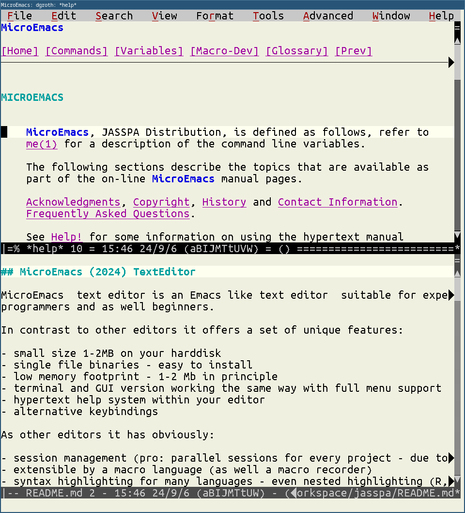
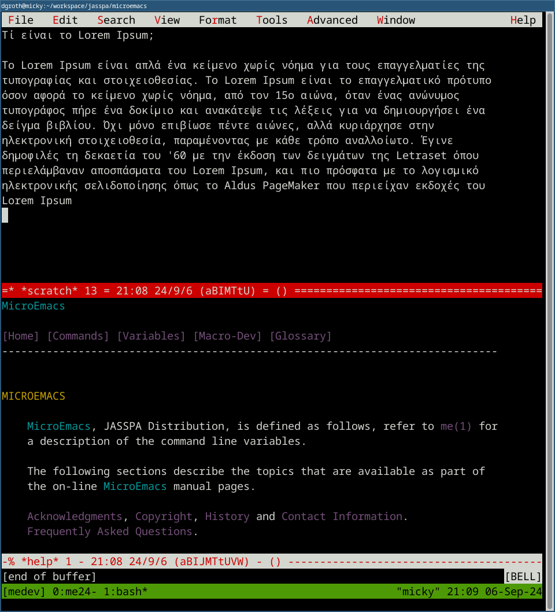

##  &nbsp;MicroEmacs (2024) TextEditor

MicroEmacs  text editor is an Emacs like text editor  suitable for 
experienced programmers and as well beginners.

In contrast to other editors it offers a set of unique features:

- small size 1-2MB on your harddisk
- single file binaries - easy to install 
- low memory footprint - 1-2 Mb in principle
- terminal and GUI version working the same way with full menu support
- hypertext help system within your editor
- alternative keybindings

As other editors it has obviously:

- session management (pro: parallel sessions for every project - 
  due to low memory footprint are no problem)
- extensible by a macro language (as well a macro recorder)
- syntax highlighting for many languages - even nested highlighting (R, Python etc in Markdown documents )
- spell checking for many languages
- and much more ...

Cons (because it is a __Micro__-Emacs):

- no Unicode  support - but all the ISO and  extended  Windows  encodings  are
  usable
- no soft (visual) wrap - what you see is what you get



## Installation

You can compile the code yourself, or you pick one or two of the precompiled
ones from the Release page.

MicroEmacs single file executables comes in two flavors:

- mecs - terminal version
- mews - GUI version (require X11 on Linux and MacOS)

Download one of the following zip archives with the binaries  inside and place
the executables into a folder belonging to your PATH

| Platform      | Terminal        | GUI (X11 on Linux/Mac) |
|:-------------:|:---------------:|:----------------------:|
| Linux         | [mecs](releases/download/me_20240901/Jasspa_MicroEmacs_20240901_abin_linux_mecs.zip)       | [mews](releases/download/me_20240901/Jasspa_MicroEmacs_20240901_abin_linux_mews.zip) |
| MacOS apple   | [mecs](releases/download/me_20240901/Jasspa_MicroEmacs_20240901_abin_macos_apple_mecs.zip) | [mews](releases/download/me_20240901/Jasspa_MicroEmacs_20240901_abin_macos_apple_mews.zip) |
| MacOS intel   | [mecs](releases/download/me_20240901/Jasspa_MicroEmacs_20240901_abin_macos_intel_mecs.zip) | [mews](releases/download/me_20240901/Jasspa_MicroEmacs_20240901_abin_macos_intel_mews.zip)
| Windows       | [mecs](releases/download/me_20240901/Jasspa_MicroEmacs_20240901_abin_windows_mecs.zip)     | [mews](releases/download/me_20240901/Jasspa_MicroEmacs_20240901_abin_windows_mews.zip)

To test the  integrity  of the  downloads  you can use the
[sha256 hash keys](https://github.com/bjasspa/jasspa/releases/download/me_20240901/Jasspa_MicroEmacs_20240901_abin.sha256).

Then test the executable in your terminal:

```
mecs -V
```

This should printout the version and exit MicroEmacs.

## User Setup

After  starting  your  first  real  session  you are  proposed  to do call the
init-session function if you like to save your settings on the current system.
You can do this by calling the  `init-session`  function. Press `Esc` and then
the `x` key, you see that you are in the command  line at the bottom can write
some text, write `init-session` press ENTER.

Then you should select your keyboard layout. Either you use the menubar on top
to find that  functionality "Esc =" should work in the terminal and in the GUI
application,  the  latter  can use as well  mouse or "Alt-t"  key and then `u`
combination, or you enter the command `Esc x user-setup`. In the Menu you have
to access the "(T)ools - (U)ser Setup" entry.

In User setup select in the "Start-Up" tab your keyboard layout and in GUI mode in
the  "Platform"  tab your font. X11 users  here will  greatly  benefit if they
installed  the  xfontsel  tool as it allows to  visually  select the font on a
MacOS or Linux system.

If you are  ready  use  "File-Save  All" to save  your  settings.  The next ME
session should start with these saved settings.


## Tools to improve your editing on Linux and MacOS

- Terminal (macOS, Linux):
    - luit - run MicroEmacs with extendd character sets on UTF-8 terminals
    - abduco - suspend a luit session
- X11 (macOS, Linux):
    - xfontsel - to interactively select fonts from within your ME session
    - mkfontscale - if you like to add your own TTF fonts as available fonts

Here as an example a bash  script  `mecu`  which runs a  MicroEmacs  on UTF-8
terminal using the Western European ISO-encodings:

```bash
#!/usr/bin/env bash
### file: mecu 
### Description: wrapper to run MicroEmacs with extended character settings
###              on UTF-8 enabled terminals
###  
### Tools required:
###   abduco: session management and detacher
###           https://www.brain-dump.org/projects/abduco/   
###   luit:   filter between non-utf-8 applications and utf-8 terminals
###           https://invisible-island.net/luit/
### Installation:
###           fedora: sudo dnf install abduco luit  
###           debian: sudo apt install abduco luit

### session name creation for the current tty 
tty=$(tty | grep -Eo '[0-9]+')
## already running? list abduco sessions
res=$(abduco -l | grep mec$tty)

### running session, if no create an new one
### otherwise attach to the old one
### (press in ME Ctrl-l to update screen if neccesary)

if [ "$res" == "" ] ; then 
    ### need a new one 
   TERM=xterm abduco -A -e ^z mec$tty luit -encoding ISO-8859-15 mecs "$@"
else
    ### attach to the old one
    abduco -a -e ^z mec$tty 
fi
```    

Change  the  filename  mecs to the  name  you  give  you  MicroEmacs  terminal
instance.  Name  the  file  `mecu`,  Make it  executable  and move to a folder
belonging  to your PATH  variable.  With this little  shell  script  using two
small tools, you can run MicroEmacs nicely as well on all UTF-8 terminals with
a more extended character set.

## License

GPL - see the file [COPYING](COPYING)

## Authors

- Dave Conroy         1985-1986
- Daniel M. Lawrence  1986-1988  
- John Green          1990-2010
- Steven Phillips     1990-2024
- Detlef Groth        2021-2024

