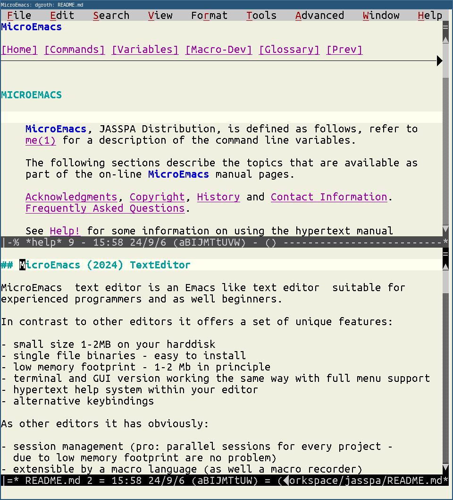

##  &nbsp;Jasspa MicroEmacs Text Editor

[](https://www.gnu.org/licenses/gpl.htm)
[](https://github.com/bjasspa/jasspa/releases)


[](https://bjasspa.github.io/jasspa/)
[](https://github.com/bjasspa/jasspa/wiki)
[](https://github.com/bjasspa/jasspa/blob/main/microemacs/contribs/cheatsheet.md)
[](https://www.star-history.com/#bjasspa/jasspa&Date)

/badge.svg)
/badge.svg)

/badge.svg)
/badge.svg)

/badge.svg)
/badge.svg)

MicroEmacs  text editor is an Emacs like text editor  suitable for 
experienced programmers and as well beginners.

In contrast to other editors it offers a set of unique features:

- small size 1-2MB on your disk
- single file binaries available - easy to install 
- low memory footprint - 1-2 MB (yes MB)
- terminal and GUI version working the same way with full menu support
- hypertext help system within your editor for MicroEmacs help but as well man
  pages or R help pages
- alternative key bindings available (Emacs, CUA, nedit)

As other editors it has obviously:

- session management (pro: parallel sessions for every project - 
  due to low memory footprint are no problem)
- extensible by a macro language (as well a macro recorder)
- syntax highlighting for many languages - even nested highlighting (R, Python etc in Markdown documents )
- spell checking for many languages
- and much more ...

Cons (because it is a __Micro__-Emacs):

- no Unicode  support - but all the ISO and  extended  Windows  encodings  are
  usable, even on UTF-8 terminals
- no  soft  (visual)  wrap - what  you  see is what  you  get (you can let ME
  autowrap for you the text during writing)

&nbsp;&nbsp;

_Left:_ GUI  version  - theme "Basic  Black on Cream",  _Right:_  Greek Text in the
Terminal  version  within a Tmux  session with an open menu entry - theme:  "Default  White on Black".
The menu entry can be opened on a terminal version usually with "Esc =".
There  are  more  than  25  themes  (schemes)  to  choose  from  ... The  main
appplication  frame is split here into two  windows, one is for editing a file, the
other here has the hyperhelp documentation open. You can as well edit the same
file within several separate  windows, for  instance writing  something on top,
and then in the  other  windows  more down in the same file ... but  obviously
editing one file in a single window is as well possible.

&nbsp;&nbsp;

_Left:_ GUI version - theme "Solarized Light", displaying on top a help page defined using Markdown (bottom window) for the [pydoc](contribs/hkpydoc.emf) macro,  
_Right:_ GUI version - theme "Ayu Dark", displaying the hypertext enabled R documentation browser defined with the r-doc command.

## Installation

### Linux/MacOS

You can compile the code yourself, or you pick one or two of the pre-compiled
single file executables from the Release page or you install the usual mec/mew
executables  using curl or the homebrew  package manager. 

Installation  using  curl for Linux and MacOS by copying and pasting the  following
command into your terminal:

```
/bin/sh -c "$(curl -fsSL https://github.com/bjasspa/jasspa/releases/latest/download/microemacs-install)"
```

Thereafter  you have to add the folder  `~/.local/bin`  to your PATH variable.
This is explained in the install  output on your terminal.  Thereafter you can
check that the binaries are installed by typing in the terminal.

```
mec -V 
```

Installation using [Homebrew](https://brew.sh) package manager on Linux or MacOS:

```
brew tap bjasspa/jasspa
brew install microemacs
```

These install methods mentioned above will provide you with the terminal  version of MicroEmacs  (mec)
and the GUI  version  (mew)  which  requires  X11 on Linux  MacOS  (using  for
instance [XQuartz](https://www.xquartz.org/).

### Windows 

For Windows you have an installer which is available [here](https://github.com/bjasspa/jasspa/releases/download/me_20251101/Jasspa_MicroEmacs_20251101_installer_windows_intel.msi)
or you can use as well the `microemacs-install.ps1` PowerShell script, run the following in a PowerShell:

`Invoke-RestMethod -Uri https://github.com/bjasspa/jasspa/releases/latest/download/microemacs-install.ps1 | Invoke-Expression`

Or download  the script  first and run locally, if you get the error cannot be
loaded because  running  scripts is disabled on this system, run the script as
follows:

`powershell -ExecutionPolicy Bypass -File microemacs-install.ps1`

Note that this will always  install the latest  release and to install for all
users  the  PowerShell  needs  to be  run  as  Administrator.  If  the  script
encounters issues during the installation  processes,  typically  insufficient
permissions, please follow the instructions given.

This will  install  as well a terminal  version of  MicroEmacs,  `mec` and GUI
version,  `mew`. For the latter you should have as well an entry in your start
menu after installation.

### Single File Executables

The MicroEmacs single file executables with macro files embedded come in two flavors:

- mesc - terminal version ('s' for single file, 'c' stands for console)
- mesw - GUI version ('w' stands for window, requires X11 on Linux and MacOS)

Download one of the following zip archives with the binaries  inside and place
the executables into a folder belonging to your PATH variable.

| Platform      | Console/Terminal | GUI (X11 on Linux/Mac) |
|:-------------:|:----------------:|:----------------------:|
| Linux intel   | [mesc](https://github.com/bjasspa/jasspa/releases/download/me_20251101/Jasspa_MicroEmacs_20251101_abin_linux_intel_mesc.zip)   | [mesw](https://github.com/bjasspa/jasspa/releases/download/me_20251101/Jasspa_MicroEmacs_20251101_abin_linux_intel_mesw.zip)   |
| Linux aarch   | [mesc](https://github.com/bjasspa/jasspa/releases/download/me_20251101/Jasspa_MicroEmacs_20251101_abin_linux_aarch_mesc.zip)   | [mesw](https://github.com/bjasspa/jasspa/releases/download/me_20251101/Jasspa_MicroEmacs_20251101_abin_linux_aarch_mesw.zip)   |
| MacOS apple   | [mesc](https://github.com/bjasspa/jasspa/releases/download/me_20251101/Jasspa_MicroEmacs_20251101_abin_macos_apple_mesc.zip)   | [mesw](https://github.com/bjasspa/jasspa/releases/download/me_20251101/Jasspa_MicroEmacs_20251101_abin_macos_apple_mesw.zip)   |
| MacOS intel   | [mesc](https://github.com/bjasspa/jasspa/releases/download/me_20251101/Jasspa_MicroEmacs_20251101_abin_macos_intel_mesc.zip)   | [mesw](https://github.com/bjasspa/jasspa/releases/download/me_20251101/Jasspa_MicroEmacs_20251101_abin_macos_intel_mesw.zip)   |
| Windows intel | [mesc](https://github.com/bjasspa/jasspa/releases/download/me_20251101/Jasspa_MicroEmacs_20251101_abin_windows_intel_mesc.zip) | [mesw](https://github.com/bjasspa/jasspa/releases/download/me_20251101/Jasspa_MicroEmacs_20251101_abin_windows_intel_mesw.zip) |
| Windows arm   | [mesc](https://github.com/bjasspa/jasspa/releases/download/me_20251101/Jasspa_MicroEmacs_20251101_abin_windows_arm_mesc.zip)   | [mesw](https://github.com/bjasspa/jasspa/releases/download/me_20251101/Jasspa_MicroEmacs_20251101_abin_windows_arm_mesw.zip)   |

To test the integrity of the downloads you can use the [sha256 hash keys](https://github.com/bjasspa/jasspa/releases/download/me_20251101/Jasspa_MicroEmacs_20251101-sha256.txt)

Then test the executable in your terminal:

```
mesc -V
```

This should printout the version and exit MicroEmacs.

## Compilation on Linux

On a Linux system you can compile the code yourself using the build scripts in
_microemacs/src_. You need the _ncurses_ for the terminal version and _libxt_ for the X-Windows version. Optionally for supporting https you might as well install the _libssel_ library. Here the procedure for a Debian based system like Ubuntu:

```bash
### install required packages
sudo apt install libssl-dev libz-dev libncurses-dev libxt-dev libxft-dev git
### download the current source code
git clone https://github.com/bjasspa/jasspa.git
cd jasspa/microemacs/src
### compile the barebone executables
bash build.sh -t c
bash build.sh -t w
### the executables are now in a folder .linux-PLATFORM-GCCVERSION-release-meX
### and in a folder bin in the parent directory
### create a standalone executable with embedded macro files
cd ../mesingle
PATH=`pwd`/../bin/linux6-intel64-gcc14:$PATH bash mesgen.sh \
    -p ../bin/linux6-intel64-gcc14/mec -o mesc
PATH=`pwd`/../bin/linux6-intel64-gcc14:$PATH bash mesgen.sh \
    -p ../bin/linux6-intel64-gcc14/mew -o mesw
```

You should replace the LINUX-PLATFORM-GCC part with your kernel, platform and GCC versions you are usng

## Documentation & Help

Jasspa's  MicroEmacs  ships with a comprehensive  set of  documentation  which
covers most  aspects of the use of the editor. It can also be browsed  on-line
[here](https://bjasspa.github.io/jasspa/).

Further  there is a  [Wiki](https://github.com/bjasspa/jasspa/wiki)  with some
tips and tricks. New documentation and scripts will be often described therein
first and later go into the official editor release.

## User Setup

After  starting  your  first  real  session  you are  proposed  to do call the
init-session function if you like to save your settings on the current system.
You can do this by calling the  `init-session`  function. Press `Esc` and then
the `x` key, you see that you are in the command  line at the bottom can write
some text, write `init-session` press ENTER.

Then you should select your keyboard layout. Either you use the menubar on top
to find that  functionality "Esc =" should work in the terminal and in the GUI
application,  the  latter  can use as well  mouse or "Alt-t"  key and then `u`
combination, or you enter the command `Esc x user-setup`. In the Menu you have
to access the "(T)ools - (U)ser Setup" entry.

In User setup select in the "Start-Up" tab your keyboard layout and in GUI mode in
the  "Platform"  tab your font. X11 users  here will  greatly  benefit if they
installed  the  xfontsel  tool as it allows to  visually  select the font on a
MacOS or Linux system.

If you are  ready  use  "File-Save  All" to save  your  settings.  The next ME
session should start with these saved settings.


## Tools to improve your editing on Linux and MacOS

- Fixing ISO / UTF-8 issues
    - _iconv_ - encoding converter
- X11 (macOS, Linux):
    - _xclip_ - importing text from the primary selection to the clipboard
- X11 (macOS, Linux) if you like to use the old legacy X11 fonts, optional since version  20251001 as ME now can use directly  TrueType ond
    OpenType fonts: 
    - _xfontsel_ - to  interactively  select old legacy X11 fonts from within your ME session
    - _mkfontscale_ - if you like to index and use your own TTF fonts as available fonts

MicroEmacs versions  before  20241001  might as require the tools luit and abduco for better
support of international character encodings on UTF-8 enabled terminals.

## Compilation

In order to compile the program  yourself  here are a few hints for  different
platforms on how to do this.

### Linux systems

Debian based systems like Ubuntu or MX-Linux:

```
sudo apt install ncurses-dev libssl-dev libxt-dev libxft-dev
```

Red Hat based systems like Fedora, Alma Linux:

```
sudo dnf install ncurses-devel libXt-devel libXft-devel
```

Arch based systems like Manjaro Linux:

```
sudo pacman -S make gcc ncurses xorg-xfontsel ttf-fira-mono
```

Fira Mono is a font  which  provides  Windows  CP1252 encoding and it is  automatically
indexed on Manjaro so that it can be  directly  used in  MicroEmacs  using the
user-setup command and then the font selection tool _xfontsel_.

## License

GPL - see the file [LICENSE](microemacs/LICENSE)

## Authors

- Dave Conroy         1985-1986
- Daniel M. Lawrence  1986-1988  
- John Green          1990-2025
- Steven Phillips     1990-2025
- Detlef Groth        2021-2025

